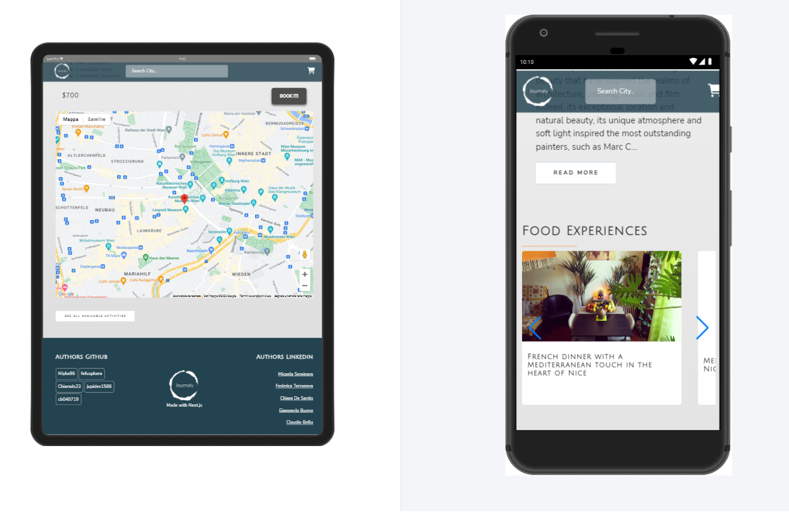

<p align="center">

</p>

<p align="center">"Not all those who wander are 404"</p>

<p align="center">
  
</p>

<hr>


<p align="center"> :world_map: Journaly is a tourism web-app: explore cities, experiences, places and so much more!</p>


<h2>Technologies used</h2>

  <ul>
    <li>HTML</li>
    <li>SASS</li>
    <li>Javascript</li>
    <li>React.js</li>
    <li>Next.js</li>
    <li>Axios</li>
    <li>Musement API</li>
    <li>Braintree API</li>
    <li>Google Maps API</li>
    <li>Designed from zero using Figma</li>
    <li>Mobile First Design</li>
  </ul>

<br>

<p align="center">
  
</p>

<hr>
<p align="center">
  
</p>
<hr>
This is a [Next.js](https://nextjs.org/) project bootstrapped with [`create-next-app`](https://github.com/vercel/next.js/tree/canary/packages/create-next-app).

## Getting Started

First, run the development server:

```bash
npm run dev
# or
yarn dev
```

Open [http://localhost:3000](http://localhost:3000) with your browser to see the result.

You can start editing the page by modifying `pages/index.js`. The page auto-updates as you edit the file.

[API routes](https://nextjs.org/docs/api-routes/introduction) can be accessed on [http://localhost:3000/api/hello](http://localhost:3000/api/hello). This endpoint can be edited in `pages/api/hello.js`.

The `pages/api` directory is mapped to `/api/*`. Files in this directory are treated as [API routes](https://nextjs.org/docs/api-routes/introduction) instead of React pages.


<h3>Made by</h3>
<ul>
  <li>
    <a href="https://github.com/Cb040719">
      Claudio Bello
    </a>
  </li>
  <li>
    <a href="https://github.com/fefusphera">
      Federica Terranova
    </a>
  </li>
  <li>
    <a href="https://github.com/jupidev1586">
     Gianpaolo Buono
    </a>
  </li>
  <li>
    <a href="https://github.com/Miyka96">
      Micaela Seminara
    </a>
  </li>
</ul>

<h4>With the special help and support of our Teacher 
  <a href="https://github.com/casiimir"> 
    Casimiro P. Ciancimino :heart:
  </a>
</h4>